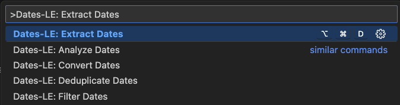

  

<h1 align="center">Colors-LE: Zero Hassle Color Extraction</h1>

  <b>Instantly extract colors from your codebase with precision</b> 
  <i>CSS, HTML, JavaScript, TypeScript, SCSS, LESS, Stylus, and SVG</i>

  <!-- VS Code Marketplace -->
  
  <!-- Open VSX -->
  
  <!-- Build -->
  
  <!-- License -->
  

  <i>Tested on <b>Ubuntu</b>, <b>macOS</b>, and <b>Windows</b> for maximum compatibility.</i>

---

  

  

## 🙏 Thank You

If Colors-LE saves you time, a quick rating helps other developers discover it:  
⭐ [VS Code Marketplace](https://marketplace.visualstudio.com/items?itemName=nolindnaidoo.colors-le) • [Open VSX](https://open-vsx.org/extension/nolindnaidoo/colors-le)

## ✅ Why Colors-LE?

Extract colors from **any stylesheet or code file** — CSS, HTML, JavaScript, SCSS — in one click. Find theme colors, brand palettes, and design tokens instantly.

Colors-LE intelligently detects HEX, RGB/RGBA, and HSL/HSLA colors while preserving original formats. Audit design systems, validate color usage, and analyze palettes without manual searching.

- **Design system audit without the hassle**  
  Instantly extract and analyze colors from any web project. Get comprehensive insights into color usage, palette consistency, and theme implementation.

- **Validation across stylesheets & components**  
  Surface every color reference for validation, accessibility checking, and design system compliance verification.

- **Confident edits in complex projects**  
  Flatten nested color definitions into a simple list you can safely analyze without breaking structure or formatting.

- **Advanced color analysis built-in**

  - **Analyze** for palette insights and color harmony
  - **Convert** between HEX, RGB, HSL, and OKLCH formats
  - **Filter** by lightness, saturation, or format
  - **Validate** for accessibility and design standards

- **Fast at any scale**  
  Benchmarked for 5M+ colors per second, Colors-LE keeps up with large design systems and enterprise codebases without slowing you down.

## 🚀 More from the LE Family

- **[String-LE](https://marketplace.visualstudio.com/items?itemName=nolindnaidoo.string-le)** - Extract user-visible strings for i18n and validation • [Open VSX](https://open-vsx.org/extension/nolindnaidoo/string-le)
- **[Numbers-LE](https://marketplace.visualstudio.com/items?itemName=nolindnaidoo.numbers-le)** - Extract and analyze numeric data with statistics • [Open VSX](https://open-vsx.org/extension/nolindnaidoo/numbers-le)
- **[EnvSync-LE](https://marketplace.visualstudio.com/items?itemName=nolindnaidoo.envsync-le)** - Keep .env files in sync with visual diffs • [Open VSX](https://open-vsx.org/extension/nolindnaidoo/envsync-le)
- **[Paths-LE](https://marketplace.visualstudio.com/items?itemName=nolindnaidoo.paths-le)** - Extract file paths from imports and dependencies • [Open VSX](https://open-vsx.org/extension/nolindnaidoo/paths-le)
- **[Scrape-LE](https://marketplace.visualstudio.com/items?itemName=nolindnaidoo.scrape-le)** - Validate scraper targets before debugging • [Open VSX](https://open-vsx.org/extension/nolindnaidoo/scrape-le)
- **[URLs-LE](https://marketplace.visualstudio.com/items?itemName=nolindnaidoo.urls-le)** - Extract URLs from web content and APIs • [Open VSX](https://open-vsx.org/extension/nolindnaidoo/urls-le)
- **[Dates-LE](https://marketplace.visualstudio.com/items?itemName=nolindnaidoo.dates-le)** - Extract temporal data from logs and APIs • [Open VSX](https://open-vsx.org/extension/nolindnaidoo/dates-le)

## 💡 Use Cases

- **Design System Auditing** - Extract all colors from stylesheets for consistency validation
- **Theme Development** - Pull color palettes from CSS variables and design tokens
- **Brand Compliance** - Find all brand colors across your codebase for validation
- **Accessibility Analysis** - Extract colors for contrast ratio and accessibility testing

## 🚀 Quick Start

1. Install from [VS Code Marketplace](https://marketplace.visualstudio.com/items?itemName=nolindnaidoo.colors-le) or [Open VSX](https://open-vsx.org/extension/nolindnaidoo/colors-le)
2. Open any supported file type (`Cmd/Ctrl + P` → search for "Colors-LE")
3. Run Quick Extract (`Cmd+Alt+C` / `Ctrl+Alt+C` / Status Bar)

## ⚙️ Configuration

Colors-LE has minimal configuration to keep things simple. Most settings are available in VS Code's settings UI under "Colors-LE".

Key settings include:

- Output format preferences (side-by-side, clipboard copy)
- Safety warnings and thresholds for large files
- Notification levels (silent, important, all)
- Status bar visibility
- Local telemetry logging for debugging

For the complete list of available settings, open VS Code Settings and search for "colors-le".

## 🌍 Language Support

🇺🇸 **English** • 🇩🇪 **German** • 🇪🇸 **Spanish** • 🇫🇷 **French** • 🇮🇩 **Indonesian** • 🇮🇹 **Italian** • 🇯🇵 **Japanese** • 🇰🇷 **Korean** • 🇧🇷 **Portuguese (Brazil)** • 🇷🇺 **Russian** • 🇺🇦 **Ukrainian** • 🇻🇳 **Vietnamese** • 🇨🇳 **Chinese (Simplified)**

## 🧩 System Requirements

**VS Code** 1.70.0+ • **Platform** Windows, macOS, Linux  
**Memory** 200MB recommended for large files

## 🔒 Privacy

100% local processing. No data leaves your machine. Optional logging: `colors-le.telemetryEnabled`

## ⚡ Performance

<!-- PERFORMANCE_START -->

Colors-LE is built for speed and efficiently processes files from 1KB to 100KB+. See [detailed benchmarks](docs/PERFORMANCE.md).

| Format         | File Size | Throughput | Duration | Memory | Tested On     |
| -------------- | --------- | ---------- | -------- | ------ | ------------- |
| **JAVASCRIPT** | 3K        | 15K        | ~2ms     | < 1KB  | Apple Silicon |
| **HTML**       | 5K        | 12K        | ~3ms     | < 1KB  | Apple Silicon |
| **CSS**        | 1K        | 8K         | ~1ms     | < 1KB  | Apple Silicon |

**Note**: Performance results are based on files containing actual colors. Files without colors are processed much faster but extract 0 colors.  
**Real-World Performance**: Tested with actual data up to 100KB (practical limit: 1MB warning, 10MB error threshold)  
**Performance Monitoring**: Built-in real-time tracking with configurable thresholds  
**Full Metrics**: [docs/PERFORMANCE.md](docs/PERFORMANCE.md) • Test Environment: macOS, Bun 1.2.22, Node 22.x

<!-- PERFORMANCE_END -->

## 🔧 Troubleshooting

**Not detecting colors?**  
Ensure file is saved with supported extension (.css, .html, .js, .ts, .scss, .less, .styl, .svg)

**Large files slow?**  
Files over 1MB may take longer. Consider splitting into smaller chunks

**Need help?**  
Check [Issues](https://github.com/nolindnaidoo/colors-le/issues) or enable logging: `colors-le.telemetryEnabled: true`

## ❓ FAQ

**What colors are extracted?**  
HEX (#rgb, #rrggbb, #rrggbbaa), RGB/RGBA, HSL/HSLA, and named colors

**Can I convert between formats?**  
Yes, use the Convert command to transform colors between HEX, RGB, HSL, and OKLCH formats

**Max file size?**  
Up to 10MB. Practical limit: 1MB for optimal performance

**Perfect for design systems?**  
Absolutely! Audit color palettes, validate brand consistency, and analyze theme implementations

## 📊 Testing

**92 unit tests** • **30.02% overall coverage, 57.83% function coverage**  
Powered by Vitest • Run with `bun test --coverage`

---

Copyright © 2025
<a href="https://github.com/nolindnaidoo">@nolindnaidoo</a>. All rights reserved.
