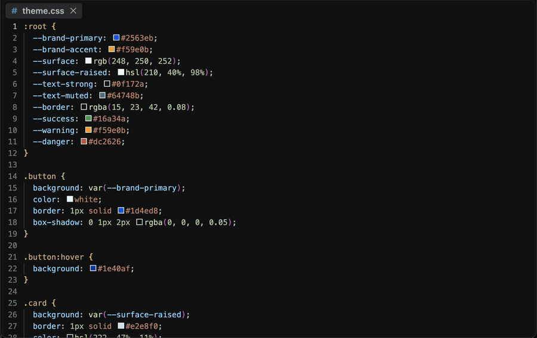

<p align="center">
  
</p>
<h1 align="center">Colors-LE: Zero Hassle Color Extraction</h1>
<p align="center">
  <b>Pull every color out of the current file in one keystroke</b><br/>
  <i>CSS, SCSS, LESS, Stylus, HTML, JavaScript, TypeScript, and SVG</i>
</p>

<p align="center">
  <a href="https://marketplace.visualstudio.com/items?itemName=nolindnaidoo.colors-le">
    
  </a>
  <a href="https://letools.dev">
    
  </a>
</p>

---

<p align="center">
  
</p>

> **Useful?** A star or rating is how other developers find it —
> [★ GitHub](https://github.com/nolindnaidoo/colors-le) ·
> [★ Marketplace](https://marketplace.visualstudio.com/items?itemName=nolindnaidoo.colors-le&ssr=false#review-details) ·
> [★ Open VSX](https://open-vsx.org/extension/OffensiveEdge/colors-le/reviews)

## What it does

Open a file, press `Ctrl+Alt+C` (`Cmd+Alt+C` on Mac), and every color in the document lands in a new editor — deduplicate, sort, convert, filter, analyze, or validate it from there. Works in VS Code and in VS Code–based editors like Cursor and VSCodium (installable from Open VSX).

- **Palette auditing** — every hex, rgb()/rgba(), hsl()/hsla(), and named color in stylesheets, markup, and code
- **Design-system review** — analyze distribution, cluster similar colors, spot near-duplicates
- **Accessibility checks** — contrast ratios against WCAG AA/AAA via the Validate command

## Supported formats

| Format | Language IDs | Where colors are recognized |
|---|---|---|
| CSS | `css` | Hex/functional literals anywhere outside comments; named colors in declaration values |
| SCSS / LESS / Stylus | `scss`, `less`, `stylus` | Same as CSS, plus `//` line comments respected; Stylus `=` assignments count as values |
| HTML | `html` | `style="…"` attributes, `<style>` blocks, `color`/`bgcolor` attributes |
| JavaScript / TypeScript | `javascript`, `javascriptreact`, `typescript`, `typescriptreact` | Inside string and template literals (theme objects, styled-components); named colors only when the whole string is the color |
| SVG | `xml` | `fill`, `stroke`, `stop-color`, `flood-color`, `lighting-color`, `color` attributes, plus style attributes/blocks |

Recognized syntax: `#rgb`, `#rgba`, `#rrggbb`, `#rrggbbaa`, comma-form `rgb()/rgba()/hsl()/hsla()` (calls may span multiple lines), and the CSS named colors including `rebeccapurple` and `transparent`. Positions are real 1-based line/column of each literal. Comments never produce colors, and comment markers inside strings don't start comments.

Known limitations (documented, not bugs): modern space-separated syntax (`rgb(255 0 0 / 50%)`) and `lab()`/`lch()`/`oklch()`/`color()` are not extracted; a hex inside any JS string matches, including URL fragments; Stylus values without `:` or `=` only yield hex/functional literals, not named colors.

## Commands

| Command | Description |
|---|---|
| `Colors-LE: Extract Colors` (`Ctrl+Alt+C` / `Cmd+Alt+C`) | Extract all colors from the active document |
| `Colors-LE: Analyze Colors` | Statistics, clusters, patterns, and palette report |
| `Colors-LE: Convert Colors` | Convert extracted colors to hex/rgb/hsl |
| `Colors-LE: Filter Colors` | Filter by format, lightness, saturation |
| `Colors-LE: Validate Colors` | Format validation and WCAG contrast checks |
| `Colors-LE: Deduplicate Colors` | Remove duplicate lines from the results |
| `Colors-LE: Sort Colors` | Sort results by the configured `sortMode` |
| `Colors-LE: Open Settings` | Open Colors-LE settings |
| `Colors-LE: Help` | Built-in documentation |

## Settings

| Setting | Default | Description |
|---|---|---|
| `colors-le.openResultsSideBySide` | `true` | Open results beside the current editor (off = replace in place) |
| `colors-le.copyToClipboardEnabled` | `false` | Also copy results to the clipboard |
| `colors-le.dedupeEnabled` | `false` | Deduplicate extraction results automatically |
| `colors-le.sortMode` | `off` | Sort order used by the Sort command (hue/saturation/lightness/hex, asc/desc) |
| `colors-le.notificationsLevel` | `silent` | `all` = every notification, `important` = warnings + errors, `silent` = errors only |
| `colors-le.safety.enabled` | `true` | Guardrails for very large files |
| `colors-le.safety.fileSizeWarnBytes` | `1000000` | Refuse extraction above this file size (override prompt offered) |
| `colors-le.safety.largeOutputLinesThreshold` | `50000` | Warn above this line count |
| `colors-le.statusBar.enabled` | `true` | Show the status bar item |
| `colors-le.telemetryEnabled` | `false` | Local-only event log (see Privacy) |

## Languages

Twelve languages besides English:

German · Spanish · French · Indonesian · Italian · Japanese · Korean ·
Portuguese (Brazil) · Russian · Ukrainian · Vietnamese · Chinese (Simplified)

Both halves are covered — the manifest (command titles, setting names and
descriptions) and everything shown while the extension runs (notifications,
the status bar, quick-picks and prompts). The extension follows VS Code's
display language, so it matches whatever the editor is already set to; no
setting of its own.

## Privacy & security

- **No network access.** The extension never sends data anywhere. The `telemetryEnabled` setting only writes events to a local Output Channel you can inspect (`Colors-LE Telemetry`).
- Error notifications redact home directories and credential-shaped fragments.

## Development

```bash
bun install
bun run build            # esbuild bundle -> dist/extension.js
bun run typecheck        # tsc --noEmit (includes tests)
bun run test             # vitest unit suite
bun run test:integration # real VS Code extension host
bun run lint             # biome
bun run package          # VSIX into release/
```

Architecture and conventions live in [AGENTS.md](AGENTS.md). Changes are tracked in [CHANGELOG.md](CHANGELOG.md).

## Performance

<!-- performance:start -->
| Input | Size | Found | Time | Rate | Scan speed |
| --- | --- | --- | --- | --- | --- |
| CSS stylesheet | 1.58 MB | 60,000 | 57.25 ms | 1,048,075/sec | 27.7 MB/s |
| SCSS variables | 1.96 MB | 60,000 | 67.02 ms | 895,249/sec | 29.3 MB/s |
| HTML markup | 1.29 MB | 50,000 | 33.72 ms | 1,482,680/sec | 38.2 MB/s |

Median of 7 runs after warmup, on Apple M5 Pro, 24 GB RAM, Node 24.3.0. Inputs are generated
by `scripts/benchmark.ts` rather than checked in, so the sizes above are
exactly what was measured. Reproduce with `bun run benchmark`.

These are machine-specific and are not asserted in CI — a benchmark that gates
a build only tells you how busy the runner was.
<!-- performance:end -->

## Testing

<!-- coverage:start -->
| Metric | Coverage |
| --- | --- |
| Statements | 90.78% |
| Branches | 79.11% |
| Functions | 95.36% |
| Lines | 92.10% |

322 test cases across 22 files, plus an integration suite that runs
in a real VS Code extension host and an end-to-end test that installs the
built `.vsix` into a clean profile.

Generated from `coverage/coverage-summary.json` by
`scripts/coverage-readme.js`; CI fails if this section drifts from a fresh
run. Reproduce with `bun run test:coverage`.
<!-- coverage:end -->

## More from the LE Family

Every tool in the family, one page: **[letools.dev](https://letools.dev)**

- **[String-LE](https://marketplace.visualstudio.com/items?itemName=nolindnaidoo.string-le)** - Extract string values for i18n from JSON, YAML, CSV, TOML, INI, and .env
- **[Paths-LE](https://marketplace.visualstudio.com/items?itemName=nolindnaidoo.paths-le)** - Extract file paths from JS/TS imports, JSON, HTML, CSS, TOML, CSV, and .env
- **[Numbers-LE](https://marketplace.visualstudio.com/items?itemName=nolindnaidoo.numbers-le)** - Extract numeric values from JSON, YAML, CSV, TOML, INI, and .env
- **[EnvSync-LE](https://marketplace.visualstudio.com/items?itemName=nolindnaidoo.envsync-le)** - Spot missing keys across your .env files, with a markdown report
- **[Regex-LE](https://marketplace.visualstudio.com/items?itemName=nolindnaidoo.regex-le)** - Find, test, and validate regular expressions with ReDoS screening
- **[Secrets-LE](https://marketplace.visualstudio.com/items?itemName=nolindnaidoo.secrets-le)** - Detect and sanitize credentials locally, before you commit
- **[Scrape-LE](https://marketplace.visualstudio.com/items?itemName=nolindnaidoo.scrape-le)** - Check whether a page is scrapeable before you write the scraper
- **[URLs-LE](https://marketplace.visualstudio.com/items?itemName=nolindnaidoo.urls-le)** - Extract URLs from documentation, configs, and code
- **[Dates-LE](https://marketplace.visualstudio.com/items?itemName=nolindnaidoo.dates-le)** - Extract and analyze dates from logs, configs, and code

## Also by nolindnaidoo

**Rust**

- **[pixelcoords](https://github.com/nolindnaidoo/pixelcoords)** - Mark pixel-exact coordinates machines can use · [pixelcoords.dev](https://pixelcoords.dev)
- **[pixelactions](https://github.com/nolindnaidoo/pixelactions)** - Perform the interaction and confirm it landed · [pixelactions.dev](https://pixelactions.dev)

**Contact Developer** — [GitHub](https://github.com/nolindnaidoo) · [LinkedIn](https://www.linkedin.com/in/nolindnaidoo/)

## License

MIT © [nolindnaidoo](https://github.com/nolindnaidoo)
