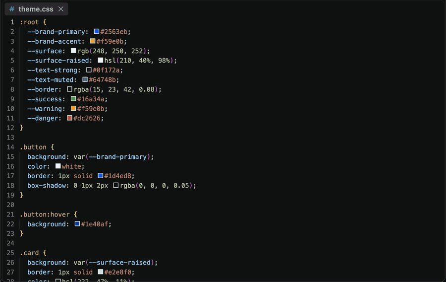

<p align="center">
  
</p>
<h1 align="center">Colors-LE: Zero Hassle Color Extraction</h1>
<p align="center">
  <b>Pull every color out of the current file in one keystroke</b><br/>
  <i>CSS, SCSS, LESS, Stylus, HTML, JavaScript, TypeScript, and SVG</i>
</p>

<p align="center">
  <a href="https://marketplace.visualstudio.com/items?itemName=nolindnaidoo.colors-le">
    
  </a>
  <a href="https://open-vsx.org/extension/nolindnaidoo/colors-le">
    
  </a>
  <a href="https://www.npmjs.com/package/colors-le-mcp">
    
  </a>
  <a href="https://crates.io/crates/colors-le">
    
  </a>
  <a href="https://letools.dev/tools/colors-le">
    
  </a>
</p>

---

<p align="center">
  
</p>

> **Useful?** A star or rating is how other developers find it —
> [★ GitHub](https://github.com/nolindnaidoo/colors-le) ·
> [★ Open VSX](https://open-vsx.org/extension/nolindnaidoo/colors-le/reviews) ·
> [★ Marketplace](https://marketplace.visualstudio.com/items?itemName=nolindnaidoo.colors-le&ssr=false#review-details)

## What it does

Open a file, run `Colors-LE: Extract Colors`, and every color in the document lands in a new editor — deduplicate, sort, convert, filter, analyze, or validate it from there. Works in VS Code and in VS Code–based editors like Cursor and VSCodium (installable from Open VSX).

- **Palette auditing** — every hex, rgb()/rgba(), hsl()/hsla(), hwb(), lab()/lch(), oklab()/oklch(), color(), and named color in stylesheets, markup, and code
- **Design-system review** — analyze distribution, cluster similar colors, spot near-duplicates
- **Accessibility checks** — contrast ratios against WCAG AA/AAA via the Validate command

## Install

| Where | What you get | Install |
|---|---|---|
| **VS Code** | Extraction, conversion, analysis and validation in your editor | [Marketplace](https://marketplace.visualstudio.com/items?itemName=nolindnaidoo.colors-le) |
| **Cursor, VSCodium, Windsurf** | The same extension | [Open VSX](https://open-vsx.org/extension/nolindnaidoo/colors-le) |
| **A terminal or a CI step** | The same extraction over a whole tree, with exit codes | `cargo install colors-le` · [crates.io](https://crates.io/crates/colors-le) |
| **Any MCP agent, via Node** | `extract_colors` over stdio | `npx colors-le-mcp` · [npm](https://www.npmjs.com/package/colors-le-mcp) |

## Use it from an AI agent

The same engine runs as an [MCP](https://modelcontextprotocol.io) server, so an agent can call it directly instead of you running a command.

| Editor | How |
|---|---|
| **VS Code** 1.101+ | Nothing to install — the extension registers `extract_colors` with agent mode |
| **Claude Code** | `claude mcp add colors-le -- npx -y colors-le-mcp` |
| **Cursor, Windsurf, anything else** | point it at `npx colors-le-mcp` |

```
extract_colors(content, format?, filename?, dedupe?, maxResults?)
```

Returns every color with its notation and 1-based line and column, capped at 500 by default with `meta.truncated` so a large stylesheet cannot flood the agent's context window.

The server takes content and returns data — it reads no files and makes no network requests of its own. Published as [`colors-le-mcp`](https://www.npmjs.com/package/colors-le-mcp) on npm and as `io.github.nolindnaidoo/colors-le` in the [MCP registry](https://registry.modelcontextprotocol.io).

<details>
<summary><b>Configuring it by hand</b> — any host with an MCP config file</summary>

Most hosts read a JSON config. Add one entry:

```json
{
  "mcpServers": {
    "colors-le": {
      "command": "npx",
      "args": ["-y", "colors-le-mcp"]
    }
  }
}
```

`-y` skips the install prompt on first run. Pin a version if you would rather not track releases — `colors-le-mcp@2.5.0`.

Prefer not to go through `npx` on every launch? Install it once and point at the binary instead:

```bash
npm install -g colors-le-mcp
```

```json
{
  "mcpServers": {
    "colors-le": { "command": "colors-le-mcp" }
  }
}
```

It speaks MCP over stdio and needs no environment variables, no API key and no configuration of its own. To check it before wiring it into anything:

```bash
echo '{"jsonrpc":"2.0","id":1,"method":"tools/list"}' | npx -y colors-le-mcp
```

That prints the tool list and exits — if you see `extract_colors`, the server works.

</details>

## Supported formats

| Format | Language IDs | Where colors are recognized |
|---|---|---|
| CSS | `css` | Hex/functional literals anywhere outside comments; named colors in declaration values |
| SCSS / LESS / Stylus | `scss`, `less`, `stylus` | Same as CSS, plus `//` line comments respected; Stylus `=` assignments count as values |
| HTML | `html` | `style="…"` attributes, `<style>` blocks, `color`/`bgcolor` attributes |
| JavaScript / TypeScript | `javascript`, `javascriptreact`, `typescript`, `typescriptreact` | Inside string and template literals (theme objects, styled-components); named colors only when the whole string is the color |
| SVG / XML | `xml`, `svg` | `fill`, `stroke`, `stop-color`, `flood-color`, `lighting-color`, `color`, `bgcolor` attributes, plus style attributes/blocks |
| JSON / YAML / TOML | `json`, `jsonc`, `yaml`, `toml` | Design tokens: literals anywhere, named colors where the value **is** the color |
| Markdown / plain text | `markdown`, `plaintext` | Same, and a 3- or 4-digit hex must contain an `a`-`f` — `#250` in prose is an issue reference |
| **Everything else** | any language id | Read as raw text under the same rules, and reported as `unknown` |

**No document is refused.** A language with no reader of its own is read as raw text, and `metadata.fileType` says which of the two answered.

Recognized syntax: `#rgb`, `#rgba`, `#rrggbb`, `#rrggbbaa`, comma-form `rgb()/rgba()/hsl()/hsla()`, CSS Color 4 modern syntax — space-separated `rgb()`/`hsl()` with `/` alpha, `hwb()`, `lab()`, `lch()`, `oklab()`, `oklch()` and `color()` in the nine predefined spaces, with angles in deg, rad, grad or turn and `none` (calls may span multiple lines), and the CSS named colors including `rebeccapurple` and `transparent`. Positions are real 1-based line/column of each literal. Comments never produce colors, and comment markers inside strings don't start comments.

Known limitations (documented, not bugs): relative colours (`rgb(from red r g b)`), `calc()` and `var()` inside a colour call are not read; a colour outside sRGB is clipped when converted; a hex inside any JS string matches, including URL fragments; Stylus values without `:` or `=` only yield hex/functional literals, not named colors; in the raw-text scan a value segment runs to the end of the line, so two tokens on one line cost the named one.

## Across a folder or a workspace

Extract reads the document you have open. A scan reads many files from disk and gives one report: the project's palette.

- **The whole workspace**: run `Colors-LE: Extract Colors from Workspace` from the command palette.
- **One folder**: right-click it in the Explorer and choose `Extract Colors from Folder`, or run `Colors-LE: Extract Colors from Folder` and pick one.

Each color is listed once however it is spelled, the most widely used first, with the spellings, how often it is written and where:

```markdown
# Colors-LE workspace report

`my-project` · 3 file(s) read · 3 distinct color(s), 7 occurrence(s) in 3 file(s)

| Color | Written as | Occurrences | Files |
|---|---|---|---|
| `#ff0000` | `#FF0000`, `#f00`, `red`, `rgb(255, 0, 0)` | 4 | 2 |
| `#00ff00` | `#00ff00` | 2 | 2 |
| `#0000ff` | `#0000ff` | 1 | 1 |

## `#ff0000` (4)

- `styles/a.css` · **1:12**, **1:30**, **2:12**
- `styles/b.css` · **1:12**

## `#00ff00` (2)

- `styles/a.css` · **2:31**
- `styles/b.css` · **1:43**

## `#0000ff` (1)

- `theme.json` · **2:14**
```

**The same color is one row.** `#f00`, `#FF0000`, `red` and `rgb(255, 0, 0)` are one color written four ways, and the table says so. Alpha keeps colors apart: a half-transparent red is another color. A value that is not a color in sRGB on its own, such as a `var()`, is compared as written.

That is with `colors-le.showPositions` on. It is off by default, and then each line is the file and how many times the color is in it: `styles/a.css (3)`. The copy on the clipboard follows `colors-le.clipboardIncludesPositions`, as it does for Extract.

**What a scan reads.** Files come from disk, so an unsaved edit is not seen. A file over the safety size, or one that is not UTF-8 text, is left unread. It stops at 5,000 files or 10,000 listed occurrences. The report ends with a line for each thing it left out, so a short report is never mistaken for a clean project.

**What it skips, and how to change that.** Three switches are on by default, and each can be turned off on its own in Settings:

| Switch | Skips |
|---|---|
| `scanUseDefaultExcludes` | Dependency folders, build output, tool caches and lockfiles. The full list is below |
| `scanRespectGitignore` | Whatever the project's `.gitignore` files skip |
| `scanSkipBinaryFiles` | Images, fonts, archives and other files that are not text |

Two lists adjust the result without turning a switch off. To skip more, add a pattern to `scanExcludes`. To read something a switch would skip, add it to `scanAlwaysInclude`:

```jsonc
{
	// Also skip the test fixtures.
	"colors-le.workspace.scanExcludes": ["**/fixtures/**"],
	// Read the vendored code, though the built-in list skips it.
	"colors-le.workspace.scanAlwaysInclude": ["**/vendor/**"]
}
```

`Colors-LE: Open Settings` opens all of these in the Settings editor.

<details>
<summary>The built-in list</summary>

Folders, wherever they appear:

<!-- built-in-folders -->
`.git`, `.hg`, `.svn`, `node_modules`, `bower_components`, `jspm_packages`, `.pnpm-store`, `.yarn`, `vendor`, `site-packages`, `Pods`, `Carthage`, `dist`, `build`, `out`, `target`, `_build`, `_site`, `dist-newstyle`, `zig-out`, `storybook-static`, `cdk.out`, `DerivedData`, `CMakeFiles`, `.next`, `.nuxt`, `.output`, `.svelte-kit`, `.angular`, `.astro`, `.docusaurus`, `.vuepress`, `.expo`, `.turbo`, `.parcel-cache`, `.cache`, `.sass-cache`, `.jekyll-cache`, `.dart_tool`, `.pub-cache`, `.gradle`, `.kotlin`, `.cxx`, `.externalNativeBuild`, `captures`, `ephemeral`, `.symlinks`, `.swiftpm`, `.build`, `.bundle`, `.stack-work`, `.zig-cache`, `.godot`, `elm-stuff`, `.vercel`, `.netlify`, `.serverless`, `.aws-sam`, `.terraform`, `.venv`, `venv`, `__pycache__`, `.tox`, `.nox`, `.mypy_cache`, `.pytest_cache`, `.ruff_cache`, `.ipynb_checkpoints`, `.eggs`, `coverage`, `htmlcov`, `.nyc_output`, `.vscode-test`, `.idea`, `.vs`, `xcuserdata`, `*.egg-info`
<!-- /built-in-folders -->

Files, wherever they appear:

<!-- built-in-files -->
`*.min.js`, `*.min.css`, `*.map`, `*.snap`, `*.lock`, `package-lock.json`, `pnpm-lock.yaml`, `npm-shrinkwrap.json`, `go.sum`, `*.pbxproj`, `*.iml`, `local.properties`, `output-metadata.json`, `.flutter-plugins`, `.flutter-plugins-dependencies`, `.packages`, `Generated.xcconfig`, `flutter_export_environment.sh`, `GeneratedPluginRegistrant.*`, `fastlane/report.xml`, `fastlane/test_output/**`, `doc/api/**`
<!-- /built-in-files -->

Not on the list, because they are ordinary folders in many projects: `bin`, `obj`, `tmp`, `logs`, `public`, `generated`. A project that generates those ignores them in git, and the scan reads `.gitignore`.

</details>

The settings that shape a scan are under [Settings](#settings).

## The CLI

The same extraction from a terminal or a CI step — a Rust CLI in
[`crate/`](crate/README.md), installed with `cargo install colors-le`.
Convert, analyze and validate are interactive and stay in the editor.

```bash
colors-le .                              # every colour in the tree
colors-le --palette brand.txt .          # what is not in the palette
colors-le --values --dedupe . | sort -u  # write the palette in the first place
colors-le mcp                            # the same extraction over MCP on stdio
```

Exit codes: 0 clean, 1 none found or a colour outside the palette, 2 the
question was malformed.

**Matched by colour, not by spelling.** A palette written in hex still
catches a violation written in `rgb()`, because `#FFF`, `#ffffff` and
`rgb(255, 255, 255)` are one entry. Alpha is part of the identity, and a
named colour is only equal to itself — `white` and `#ffffff` are the same
pixel and not the same decision.

## Commands

| Command | Description |
|---|---|
| `Colors-LE: Extract Colors` | Extract all colors from the active document |
| `Colors-LE: Extract Colors from Workspace` | The palette of every file in the workspace: each color once, with its spellings and where it is |
| `Colors-LE: Extract Colors from Folder` | The same for one folder. Also on a folder in the Explorer |
| `Colors-LE: Analyze Colors` | Statistics, clusters, patterns, and palette report |
| `Colors-LE: Convert Colors` | Convert extracted colors to hex/rgb/hsl |
| `Colors-LE: Filter Colors` | Filter by format, lightness, saturation |
| `Colors-LE: Validate Colors` | Format validation and WCAG contrast checks |
| `Colors-LE: Deduplicate Colors` | Remove duplicate lines from the results |
| `Colors-LE: Sort Colors` | Sort results by the configured `sortMode` |
| `Colors-LE: Open Settings` | Open Colors-LE settings |
| `Colors-LE: Help` | Built-in documentation |

No command is bound to a key by default. Give any of them one under **Keyboard Shortcuts** in the editor.

## Settings

| Setting | Default | Description |
|---|---|---|
| `colors-le.openResultsSideBySide` | `true` | Open results beside the current editor (off = replace in place) |
| `colors-le.showPositions` | `false` | Show the line and column of each color |
| `colors-le.copyToClipboardEnabled` | `false` | Also copy results to the clipboard |
| `colors-le.clipboardIncludesPositions` | `false` | Include the line and column in that copy |
| `colors-le.dedupeEnabled` | `false` | Deduplicate extraction results automatically |
| `colors-le.sortMode` | `off` | Sort order used by the Sort command (hue/saturation/lightness/hex, asc/desc) |
| `colors-le.notificationsLevel` | `silent` | `all` = every notification, `important` = warnings + errors, `silent` = errors only |
| `colors-le.workspace.scanPatterns` | `["**/*"]` | The files a folder or workspace scan reads |
| `colors-le.workspace.scanUseDefaultExcludes` | `true` | Skip dependency folders, build output, caches and lockfiles |
| `colors-le.workspace.scanRespectGitignore` | `true` | Skip what the project's `.gitignore` files skip |
| `colors-le.workspace.scanSkipBinaryFiles` | `true` | Skip images, fonts, archives and other files that are not text |
| `colors-le.workspace.scanExcludes` | `[]` | More files to skip, as glob patterns |
| `colors-le.workspace.scanAlwaysInclude` | `[]` | Files to read even when one of the three above would skip them |
| `colors-le.workspace.scanMaxFiles` | `5000` | The most files one scan reads |
| `colors-le.workspace.scanMaxResults` | `10000` | The most occurrences one scan lists before it stops reading |
| `colors-le.safety.enabled` | `true` | Guardrails for very large files |
| `colors-le.safety.fileSizeWarnBytes` | `1000000` | Refuse extraction above this file size (override prompt offered) |
| `colors-le.safety.largeOutputLinesThreshold` | `50000` | Warn above this line count |
| `colors-le.statusBar.enabled` | `true` | Show the status bar item |
| `colors-le.telemetryEnabled` | `false` | Local-only event log (see Privacy) |

## Languages

Twelve languages besides English:

German · Spanish · French · Indonesian · Italian · Japanese · Korean ·
Portuguese (Brazil) · Russian · Ukrainian · Vietnamese · Chinese (Simplified)

Both halves are covered — the manifest (command titles, setting names and
descriptions) and everything shown while the extension runs (notifications,
the status bar, quick-picks and prompts). The extension follows VS Code's
display language, so it matches whatever the editor is already set to; no
setting of its own.

## Privacy & security

- **No network access.** The extension never sends data anywhere. The `telemetryEnabled` setting only writes events to a local Output Channel you can inspect (`Colors-LE Telemetry`).
- **The MCP server holds the same line.** It takes content as an argument and returns data: no filesystem access, no network calls, no telemetry. Your agent already has file-read tools, so duplicating them inside the server would add a path-traversal surface for no capability. `check:mcp-bundle` fails the build if the server ever imports something that could reach either.
- Error notifications redact home directories and credential-shaped fragments.

## Documentation

| What | Where |
|---|---|
| What the tool is allowed to say — extraction scope, output contract, refusals, non-goals | [`crate/SPEC.md`](crate/SPEC.md) |
| How the extension is built and held together — architecture, invariants, toolchain, release | [AGENTS.md](AGENTS.md) |
| How the CLI is built and held together | [`crate/AGENTS.md`](crate/AGENTS.md) |
| What changed | [CHANGELOG.md](CHANGELOG.md) · [`crate/CHANGELOG.md`](crate/CHANGELOG.md) |
| The tool's page, and the other fifteen | [letools.dev/tools/colors-le](https://letools.dev/tools/colors-le) |

## Performance

<!-- performance:start -->
| Input | Size | Found | Time | Rate | Scan speed |
| --- | --- | --- | --- | --- | --- |
| CSS stylesheet | 1.58 MB | 60,000 | 57.25 ms | 1,048,075/sec | 27.7 MB/s |
| SCSS variables | 1.96 MB | 60,000 | 67.02 ms | 895,249/sec | 29.3 MB/s |
| HTML markup | 1.29 MB | 50,000 | 33.72 ms | 1,482,680/sec | 38.2 MB/s |

Median of 7 runs after warmup, on Apple M5 Pro, 24 GB RAM, Node 24.3.0. Inputs are generated
by `scripts/benchmark.ts` rather than checked in, so the sizes above are
exactly what was measured. Reproduce with `bun run benchmark`.

These are machine-specific and are not asserted in CI — a benchmark that gates
a build only tells you how busy the runner was.
<!-- performance:end -->

## Testing

<!-- coverage:start -->
| Metric | Coverage |
| --- | --- |
| Statements | 91.26% |
| Branches | 80.73% |
| Functions | 96.00% |
| Lines | 92.84% |

423 test cases across 30 files, plus an integration suite that runs
in a real VS Code extension host and an end-to-end test that installs the
built `.vsix` into a clean profile.

Generated from a real run — `coverage/coverage-summary.json` and
`coverage/test-results.json` — by `scripts/coverage-readme.js`; CI fails if
this section drifts. Reproduce with `bun run test:coverage`, and the case
count is the one vitest prints.
<!-- coverage:end -->

## More from the LE family

Sixteen single-purpose tools for the work in front of every model. Each ships
a Rust CLI and an MCP server. One page: **[letools.dev](https://letools.dev)**

**Get it out**

- **[String-LE](https://letools.dev/tools/string-le)** — Extract every string in a codebase, with its position, so a person can read them
- **[Numbers-LE](https://letools.dev/tools/numbers-le)** — Extract every hardcoded number in a codebase, so a person can check them
- **[Units-LE](https://letools.dev/tools/units-le)** — Extract every quantity with its unit, normalized, and refuse the ambiguous ones by name
- **[Dates-LE](https://letools.dev/tools/dates-le)** — Extract every date and timestamp, and the exact instant each one resolves to
- **[IDs-LE](https://letools.dev/tools/ids-le)** — Extract every UUID, ULID, NanoID, ObjectId and Snowflake, and decode the time inside
- **[IPs-LE](https://letools.dev/tools/ips-le)** — Extract every IP address, CIDR block and MAC, normalized and classified by scope
- **[URLs-LE](https://letools.dev/tools/urls-le)** — Extract every URL in a codebase, with its protocol and exact position
- **[Paths-LE](https://letools.dev/tools/paths-le)** — Extract every file path in a codebase, and say whether it still points at anything
- **[Colors-LE](https://letools.dev/tools/colors-le)** — Extract every color in a codebase, and say which ones are not in your palette

**Check it**

- **[Regex-LE](https://letools.dev/tools/regex-le)** — Find every regex in a codebase, and report which can be driven into catastrophic backtracking
- **[Versions-LE](https://letools.dev/tools/versions-le)** — Find where one dependency is constrained differently across a repository's manifests
- **[i18n-LE](https://letools.dev/tools/i18n-le)** — Identify the i18n library a project uses, then audit its catalogs by that library's rules
- **[Scrape-LE](https://letools.dev/tools/scrape-le)** — Check whether a page is scrapeable before the scraper is written, and say when it cannot tell

**Guard it**

- **[Secrets-LE](https://letools.dev/tools/secrets-le)** — Find hardcoded credentials in a codebase, and never print one into the report
- **[EnvSync-LE](https://letools.dev/tools/envsync-le)** — Compare the dotenv files in a tree, and say which keys are missing from which
- **[Unicode-LE](https://letools.dev/tools/unicode-le)** — Find the Unicode that hides meaning — bidi controls, invisibles, homoglyphs, mixed scripts

Each stands on its own: no shared crate, no published core. Where two of them
agree, it is because the same answer was right twice.

**Contact** — [nolindnaidoo.com](https://nolindnaidoo.com) · [GitHub](https://github.com/nolindnaidoo) · [LinkedIn](https://www.linkedin.com/in/nolindnaidoo/)

## Also by nolindnaidoo

**Rust** — pixelcoords and pixelactions are one loop: pixelcoords answers
*where*, pixelactions *acts* there. Their own tools, their own voice — not
part of the LE family.

- **[pixelcoords](https://github.com/nolindnaidoo/pixelcoords)** — Freeze your screen, mark regions, get pixel-exact coordinates and crops
  [pixelcoords.dev](https://pixelcoords.dev) · [crates.io](https://crates.io/crates/pixelcoords) · [docs.rs](https://docs.rs/pixelcoords)
- **[pixelactions](https://github.com/nolindnaidoo/pixelactions)** — Consume human-verified coordinates, perform the interaction, confirm it landed
  [pixelactions.dev](https://pixelactions.dev) · [crates.io](https://crates.io/crates/pixelactions) · [docs.rs](https://docs.rs/pixelactions)

## License

MIT © [nolindnaidoo](https://github.com/nolindnaidoo)
